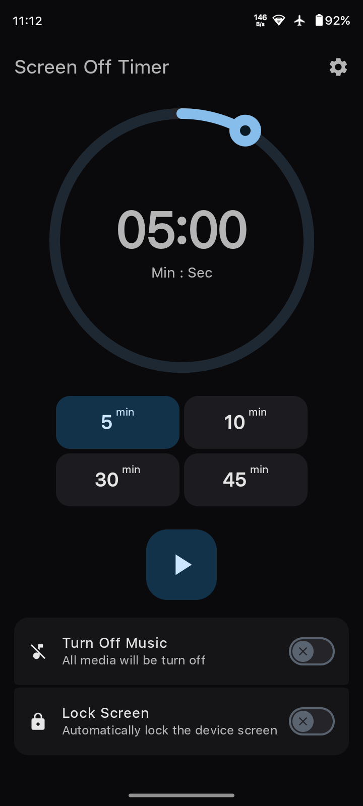
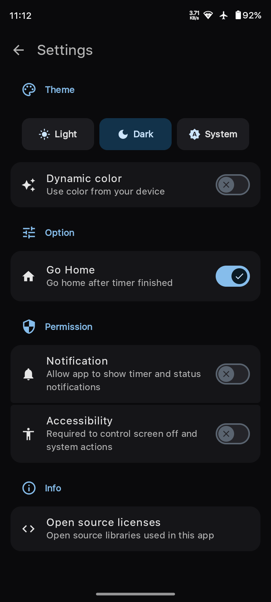
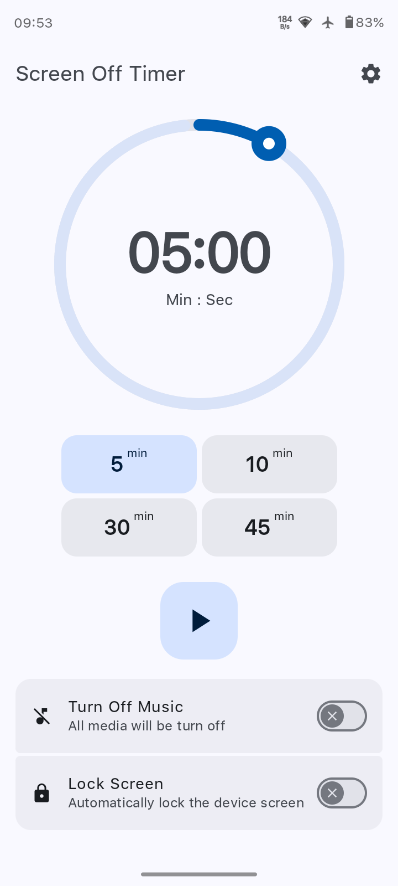
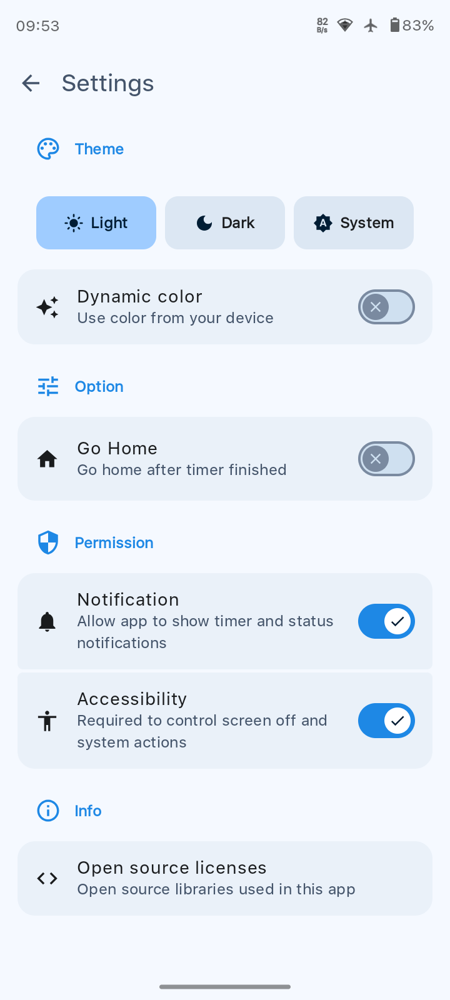

# Sleep Timer for Android
Android application designed to automatically turn off your screen or pause media playback after a set duration. 

## Screenshots
### Dark theme

 

### Light theme

 

### Key Features
- Precision Timer: Easily set your desired countdown using a modern picker or slider.

- Jetpack Compose UI: A fully reactive and smooth user interface built with the latest toolkit.

- Material 3 Design: Sleek, modern aesthetics featuring dynamic colors and clean layouts.

## Tech Stack
- Language: Kotlin

- UI Framework: Jetpack Compose

- Design System: Material Design 3

- Concurrency: Kotlin Coroutines & Flow

### How to Use
1. Launch the Screen off app.

2. Adjust the timer duration (e.g., 30 minutes).

3. Tap the Icon play button to start.

The app will count down in the background. Once it reaches zero, it will trigger the screen-off or media-stop action.
 
